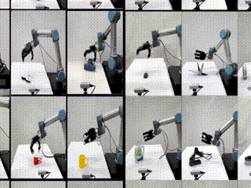

# About me

I am currently a student at [HKUST(GZ)](https://www.hkust-gz.edu.cn/), under the supervision of Prof. [Jie Song]("https://facultyprofiles.hkust-gz.edu.cn/faculty-personal-page/SONG-Jie/jsongroas"). My research focuses on general grasping and manipulation skills of multi-fingered dexterous hands. Previously, I worked for four years at [TAPO](https://www.tapo.com/en/) and [DREAME](https://www.dreametech.com/?srsltid=AfmBOopjTLrnPBuzvDYJRBLCjDf-zoXCgxdxI4_0B7PR0jSNGym5bSyC) as an embedded software and robotics algorithm engineer, where I contributed to the development of [smart security cameras](https://www.tp-link.com/us/home-networking/cloud-camera/tapo-c320ws/) and [robotic vacuum cleaners](https://www.tp-link.com/us/smart-home/robot-vacuum/tapo-rv30c-plus/).

I hold a Bachelor's degree in Automation from [SCUT](https://www.scut.edu.cn/en/), where I participated in various robotics competitions, achieving championships in the 3rd and 4th [RoboMaster](https://www.robomaster.com/en-US) competitions and reaching the top 16 in the [ABU RoboCon](http://aburobocon2019.mnb.mn/en/gallery/show/50).

My technical expertise includes Embedded Drivers and Systems in MCU and SOC, 802.11 protocol stack, Robotic Navigation, SLAM, Industrial Vision Measurement, and Reinforcement Learning. I am proficient in programming languages such as Assembly, C/C++, and Python.

# Publications

* FunGrasp: Functional Grasping for Diverse Dexterous Hands, [[Project Page](https://hly-123.github.io/FunGrasp/)], [[Paper](https://arxiv.org/pdf/2411.16755)]

TBD...

* Robust Dexterous Grasping of General Objects from Single-view Perception, [[Project Page], [Paper]]

